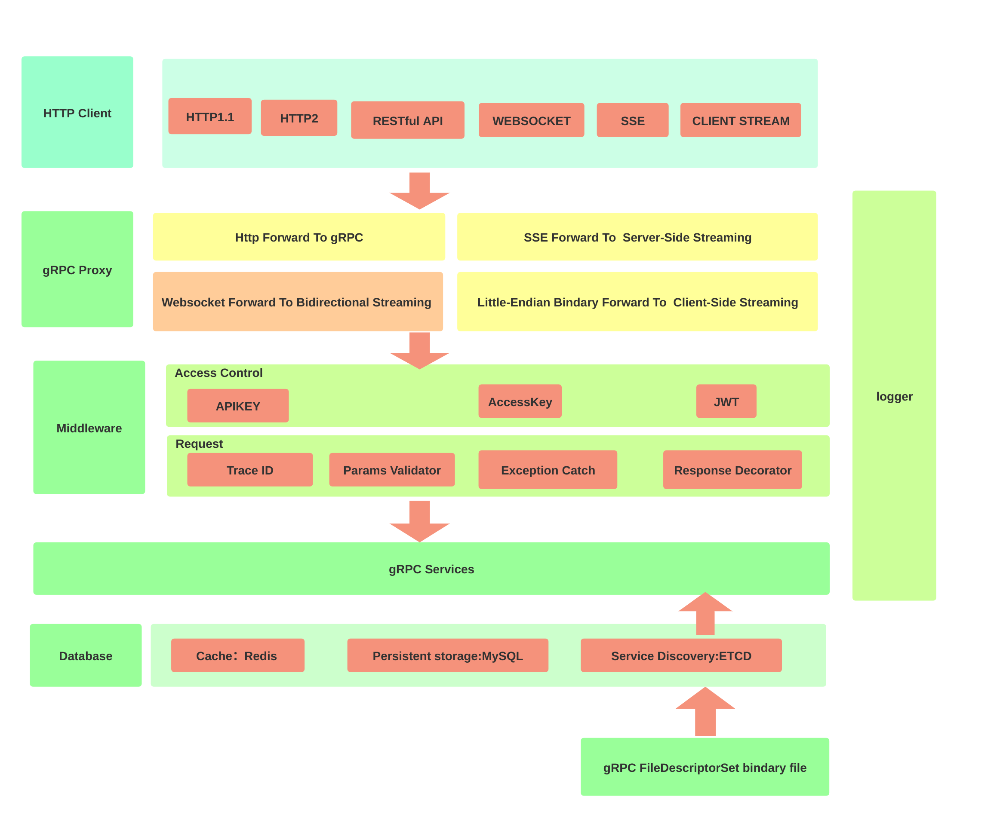

# 架构

Begonia 是一个 HTTP 反向代理服务器，支持基于 http1.1 协议对各类 gRPC 服务进行代理转发。


## 核心模块

### 1、流量转发

- 该模块的核心功能是基于[gRPC-gateway](https://github.com/grpc-ecosystem/grpc-gateway)对 http 路由进行管理和维护。
- Begonia 根据请求头携带的 content-type 选择对应的序列化器将 http 请求数据和请求参数序列化为 protobuf 数据并转发到下游的 gRPC service。
- 基于 gRPC 的`grpc.UnknownServiceHandler`实现对 gRPC 流量的转发。
- 同样的，begonia 会根据 Accept 将 gRPC 服务返回的数据序列化为对应的数据格式

### 2、gRPC 中间件

begonia 提供了两类中间件：

- 访问控制中间件，包含了 apikey、AKSK 及 JWT 身份认证方式，用于对于请求进行身份认证
- 请求处理中间件，包含 RequestId 生成、参数校验、异常捕获及响应体格式修饰模块

### 3、服务注册和发现

Begonia 通过`protoc --descriptor_set_out`生成的`FileDescriptorSet`二进制文件对于服务进行解析、更新和维护，在注册服务时需要按照下面的数据格式提交到 ETCD:

```json
{
  "descriptor_set": "<base64(FileDescriptorSet bindary data)>",
  "name": "test",
  "service_name": "test",
  "description": "test",
  "endpoints": [
    {
      "addr": "127.0.0.1:21213",
      "weight": 0
    },
    {
      "addr": "127.0.0.1:21214",
      "weight": 0
    },
    {
      "addr": "127.0.0.1:21215",
      "weight": 0
    }
  ],
  "balance": "RR",
  "tags": ["test"]
}
```
# 初始化
- Begonia 服务的初始化主要内容包括：

  - MySQL创建数据表

  - 生成admin用户账号和密码

  - 生成admin app AccessKey和SecretKey
- 初始化命令如下：
```bash
begonia init -e dev -c config/settings.yml
```
  - 参数`-e`指定环境，可选值为`dev`、`test`、`prod`，默认为`prod`  
  - 参数`-c`指定配置文件路径，默认为`config/settings.yml`
- 默认admin用户账号和密码为`admin`和`admin`，可以在配置文件中修改
- 初始化生成admin app的AccessKey和SecretKey，在`~/.begonia/admin-app.json`中保存


# 添加Endpoint
Endpoint是指业务的应用服务的配置，包含应用的地址和gRPC服务描述服的集合，一个完整的Endpoint对象如下：
```json
{
    "descriptor_set": "CqwFChVnb29nbGUvYXBpL2h0dHAucHJvdG8SCmdvb2dsZS5hcGkieQoESHR0cBIqCgVydWxlcxgBIAMoCzIULmdvb2dsZS5hcGkuSHR0cFJ1bGVSBXJ1bGVzEkUKH2Z1bGx5X2RlY29kZV9yZXNlcnZlZF9leHBhbnNpb24YAiABKAhSHGZ1bGx5RGVjb2RlUmVzZXJ2ZWRFeHBhbnNpb24i2gIKCEh0dHBSdWxlEhoKCHNlbGVjdG9yGAEgASgJUghzZWxlY3RvchISCgNnZXQYAiABKAlIAFIDZ2V0EhIKA3B1dBgDIAEoCUgAUgNwdXQSFAoEcG9zdBgEIAEoCUgAUgRwb3N0EhgKBmRlbGV0ZRgFIAEoCUgAUgZkZWxldGUSFgoFcGF0Y2gYBiABKAlIAFIFcGF0Y2gSNwoGY3VzdG9tGAggASgLMh0uZ29vZ2xlLmFwaS5DdXN0b21IdHRwUGF0dGVybkgAUgZjdXN0b20SEgoEYm9keRgHIAEoCVIEYm9keRIjCg1yZXNwb25zZV9ib2R5GAwgASgJUgxyZXNwb25zZUJvZHkSRQoTYWRkaXRpb25hbF9iaW5kaW5ncxgLIAMoCzIULmdvb2dsZS5hcGkuSHR0cFJ1bGVSEmFkZGl0aW9uYWxCaW5kaW5nc0IJCgdwYXR0ZXJuIjsKEUN1c3RvbUh0dHBQYXR0ZXJuEhIKBGtpbmQYASABKAlSBGtpbmQSEgoEcGF0aBgCIAEoCVIEcGF0aEJqCg5jb20uZ29vZ2xlLmFwaUIJSHR0cFByb3RvUAFaQWdvb2dsZS5nb2xhbmcub3JnL2dlbnByb3RvL2dvb2dsZWFwaXMvYXBpL2Fubm90YXRpb25zO2Fubm90YXRpb25z+AEBogIER0FQSWIGcHJvdG8zCuFCCiBnb29nbGUvcHJvdG9idWYvZGVzY3JpcHRvci5wcm90bxIPZ29vZ2xlLnByb3RvYnVmIk0KEUZpbGVEZXNjcmlwdG9yU2V0EjgKBGZpbGUYASADKAsyJC5nb29nbGUucHJvdG9idWYuRmlsZURlc2NyaXB0b3JQcm90b1IEZmlsZSL+BAoTRmlsZURlc2NyaXB0b3JQcm90bxISCgRuYW1lGAEgASgJUgRuYW1lEhgKB3BhY2thZ2UYAiABKAlSB3BhY2thZ2USHgoKZGVwZW5kZW5jeRgDIAMoCVIKZGVwZW5kZW5jeRIrChFwdWJsaWNfZGVwZW5kZW5jeRgKIAMoBVIQcHVibGljRGVwZW5kZW5jeRInCg93ZWFrX2RlcGVuZGVuY3kYCyADKAVSDndlYWtEZXBlbmRlbmN5EkMKDG1lc3NhZ2VfdHlwZRgEIAMoCzIgLmdvb2dsZS5wcm90b2J1Zi5EZXNjcmlwdG9yUHJvdG9SC21lc3NhZ2VUeXBlEkEKCWVudW1fdHlwZRgFIAMoCzIkLmdvb2dsZS5wcm90b2J1Zi5FbnVtRGVzY3JpcHRvclByb3RvUghlbnVtVHlwZRJBCgdzZXJ2aWNlGAYgAygLMicuZ29vZ2xlLnByb3RvYnVmLlNlcnZpY2VEZXNjcmlwdG9yUHJvdG9SB3NlcnZpY2USQwoJZXh0ZW5zaW9uGAcgAygLMiUuZ29vZ2xlLnByb3RvYnVmLkZpZWxkRGVzY3JpcHRvclByb3RvUglleHRlbnNpb24SNgoHb3B0aW9ucxgIIAEoCzIcLmdvb2dsZS5wcm90b2J1Zi5GaWxlT3B0aW9uc1IHb3B0aW9ucxJJChBzb3VyY2VfY29kZV9pbmZvGAkgASgLMh8uZ29vZ2xlLnByb3RvYnVmLlNvdXJjZUNvZGVJbmZvUg5zb3VyY2VDb2RlSW5mbxIWCgZzeW50YXgYDCABKAlSBnN5bnRheBIYCgdlZGl0aW9uGA0gASgJUgdlZGl0aW9uIrkGCg9EZXNjcmlwdG9yUHJvdG8SEgoEbmFtZRgBIAEoCVIEbmFtZRI7CgVmaWVsZBgCIAMoCzIlLmdvb2dsZS5wcm90b2J1Zi5GaWVsZERlc2NyaXB0b3JQcm90b1IFZmllbGQSQwoJZXh0ZW5zaW9uGAYgAygLMiUuZ29vZ2xlLnByb3RvYnVmLkZpZWxkRGVzY3JpcHRvclByb3RvUglleHRlbnNpb24SQQoLbmVzdGVkX3R5cGUYAyADKAsyIC5nb29nbGUucHJvdG9idWYuRGVzY3JpcHRvclByb3RvUgpuZXN0ZWRUeXBlEkEKCWVudW1fdHlwZRgEIAMoCzIkLmdvb2dsZS5wcm90b2J1Zi5FbnVtRGVzY3JpcHRvclByb3RvUghlbnVtVHlwZRJYCg9leHRlbnNpb25fcmFuZ2UYBSADKAsyLy5nb29nbGUucHJvdG9idWYuRGVzY3JpcHRvclByb3RvLkV4dGVuc2lvblJhbmdlUg5leHRlbnNpb25SYW5nZRJECgpvbmVvZl9kZWNsGAggAygLMiUuZ29vZ2xlLnByb3RvYnVmLk9uZW9mRGVzY3JpcHRvclByb3RvUglvbmVvZkRlY2wSOQoHb3B0aW9ucxgHIAEoCzIfLmdvb2dsZS5wcm90b2J1Zi5NZXNzYWdlT3B0aW9uc1IHb3B0aW9ucxJVCg5yZXNlcnZlZF9yYW5nZRgJIAMoCzIuLmdvb2dsZS5wcm90b2J1Zi5EZXNjcmlwdG9yUHJvdG8uUmVzZXJ2ZWRSYW5nZVINcmVzZXJ2ZWRSYW5nZRIjCg1yZXNlcnZlZF9uYW1lGAogAygJUgxyZXNlcnZlZE5hbWUaegoORXh0ZW5zaW9uUmFuZ2USFAoFc3RhcnQYASABKAVSBXN0YXJ0EhAKA2VuZBgCIAEoBVIDZW5kEkAKB29wdGlvbnMYAyABKAsyJi5nb29nbGUucHJvdG9idWYuRXh0ZW5zaW9uUmFuZ2VPcHRpb25zUgdvcHRpb25zGjcKDVJlc2VydmVkUmFuZ2USFAoFc3RhcnQYASABKAVSBXN0YXJ0EhAKA2VuZBgCIAEoBVIDZW5kInwKFUV4dGVuc2lvblJhbmdlT3B0aW9ucxJYChR1bmludGVycHJldGVkX29wdGlvbhjnByADKAsyJC5nb29nbGUucHJvdG9idWYuVW5pbnRlcnByZXRlZE9wdGlvblITdW5pbnRlcnByZXRlZE9wdGlvbioJCOgHEICAgIACIsEGChRGaWVsZERlc2NyaXB0b3JQcm90bxISCgRuYW1lGAEgASgJUgRuYW1lEhYKBm51bWJlchgDIAEoBVIGbnVtYmVyEkEKBWxhYmVsGAQgASgOMisuZ29vZ2xlLnByb3RvYnVmLkZpZWxkRGVzY3JpcHRvclByb3RvLkxhYmVsUgVsYWJlbBI+CgR0eXBlGAUgASgOMiouZ29vZ2xlLnByb3RvYnVmLkZpZWxkRGVzY3JpcHRvclByb3RvLlR5cGVSBHR5cGUSGwoJdHlwZV9uYW1lGAYgASgJUgh0eXBlTmFtZRIaCghleHRlbmRlZRgCIAEoCVIIZXh0ZW5kZWUSIwoNZGVmYXVsdF92YWx1ZRgHIAEoCVIMZGVmYXVsdFZhbHVlEh8KC29uZW9mX2luZGV4GAkgASgFUgpvbmVvZkluZGV4EhsKCWpzb25fbmFtZRgKIAEoCVIIanNvbk5hbWUSNwoHb3B0aW9ucxgIIAEoCzIdLmdvb2dsZS5wcm90b2J1Zi5GaWVsZE9wdGlvbnNSB29wdGlvbnMSJwoPcHJvdG8zX29wdGlvbmFsGBEgASgIUg5wcm90bzNPcHRpb25hbCK2AgoEVHlwZRIPCgtUWVBFX0RPVUJMRRABEg4KClRZUEVfRkxPQVQQAhIOCgpUWVBFX0lOVDY0EAMSDwoLVFlQRV9VSU5UNjQQBBIOCgpUWVBFX0lOVDMyEAUSEAoMVFlQRV9GSVhFRDY0EAYSEAoMVFlQRV9GSVhFRDMyEAcSDQoJVFlQRV9CT09MEAgSDwoLVFlQRV9TVFJJTkcQCRIOCgpUWVBFX0dST1VQEAoSEAoMVFlQRV9NRVNTQUdFEAsSDgoKVFlQRV9CWVRFUxAMEg8KC1RZUEVfVUlOVDMyEA0SDQoJVFlQRV9FTlVNEA4SEQoNVFlQRV9TRklYRUQzMhAPEhEKDVRZUEVfU0ZJWEVENjQQEBIPCgtUWVBFX1NJTlQzMhAREg8KC1RZUEVfU0lOVDY0EBIiQwoFTGFiZWwSEgoOTEFCRUxfT1BUSU9OQUwQARISCg5MQUJFTF9SRVFVSVJFRBACEhIKDkxBQkVMX1JFUEVBVEVEEAMiYwoUT25lb2ZEZXNjcmlwdG9yUHJvdG8SEgoEbmFtZRgBIAEoCVIEbmFtZRI3CgdvcHRpb25zGAIgASgLMh0uZ29vZ2xlLnByb3RvYnVmLk9uZW9mT3B0aW9uc1IHb3B0aW9ucyLjAgoTRW51bURlc2NyaXB0b3JQcm90bxISCgRuYW1lGAEgASgJUgRuYW1lEj8KBXZhbHVlGAIgAygLMikuZ29vZ2xlLnByb3RvYnVmLkVudW1WYWx1ZURlc2NyaXB0b3JQcm90b1IFdmFsdWUSNgoHb3B0aW9ucxgDIAEoCzIcLmdvb2dsZS5wcm90b2J1Zi5FbnVtT3B0aW9uc1IHb3B0aW9ucxJdCg5yZXNlcnZlZF9yYW5nZRgEIAMoCzI2Lmdvb2dsZS5wcm90b2J1Zi5FbnVtRGVzY3JpcHRvclByb3RvLkVudW1SZXNlcnZlZFJhbmdlUg1yZXNlcnZlZFJhbmdlEiMKDXJlc2VydmVkX25hbWUYBSADKAlSDHJlc2VydmVkTmFtZRo7ChFFbnVtUmVzZXJ2ZWRSYW5nZRIUCgVzdGFydBgBIAEoBVIFc3RhcnQSEAoDZW5kGAIgASgFUgNlbmQigwEKGEVudW1WYWx1ZURlc2NyaXB0b3JQcm90bxISCgRuYW1lGAEgASgJUgRuYW1lEhYKBm51bWJlchgCIAEoBVIGbnVtYmVyEjsKB29wdGlvbnMYAyABKAsyIS5nb29nbGUucHJvdG9idWYuRW51bVZhbHVlT3B0aW9uc1IHb3B0aW9ucyKnAQoWU2VydmljZURlc2NyaXB0b3JQcm90bxISCgRuYW1lGAEgASgJUgRuYW1lEj4KBm1ldGhvZBgCIAMoCzImLmdvb2dsZS5wcm90b2J1Zi5NZXRob2REZXNjcmlwdG9yUHJvdG9SBm1ldGhvZBI5CgdvcHRpb25zGAMgASgLMh8uZ29vZ2xlLnByb3RvYnVmLlNlcnZpY2VPcHRpb25zUgdvcHRpb25zIokCChVNZXRob2REZXNjcmlwdG9yUHJvdG8SEgoEbmFtZRgBIAEoCVIEbmFtZRIdCgppbnB1dF90eXBlGAIgASgJUglpbnB1dFR5cGUSHwoLb3V0cHV0X3R5cGUYAyABKAlSCm91dHB1dFR5cGUSOAoHb3B0aW9ucxgEIAEoCzIeLmdvb2dsZS5wcm90b2J1Zi5NZXRob2RPcHRpb25zUgdvcHRpb25zEjAKEGNsaWVudF9zdHJlYW1pbmcYBSABKAg6BWZhbHNlUg9jbGllbnRTdHJlYW1pbmcSMAoQc2VydmVyX3N0cmVhbWluZxgGIAEoCDoFZmFsc2VSD3NlcnZlclN0cmVhbWluZyKRCQoLRmlsZU9wdGlvbnMSIQoMamF2YV9wYWNrYWdlGAEgASgJUgtqYXZhUGFja2FnZRIwChRqYXZhX291dGVyX2NsYXNzbmFtZRgIIAEoCVISamF2YU91dGVyQ2xhc3NuYW1lEjUKE2phdmFfbXVsdGlwbGVfZmlsZXMYCiABKAg6BWZhbHNlUhFqYXZhTXVsdGlwbGVGaWxlcxJECh1qYXZhX2dlbmVyYXRlX2VxdWFsc19hbmRfaGFzaBgUIAEoCEICGAFSGWphdmFHZW5lcmF0ZUVxdWFsc0FuZEhhc2gSOgoWamF2YV9zdHJpbmdfY2hlY2tfdXRmOBgbIAEoCDoFZmFsc2VSE2phdmFTdHJpbmdDaGVja1V0ZjgSUwoMb3B0aW1pemVfZm9yGAkgASgOMikuZ29vZ2xlLnByb3RvYnVmLkZpbGVPcHRpb25zLk9wdGltaXplTW9kZToFU1BFRURSC29wdGltaXplRm9yEh0KCmdvX3BhY2thZ2UYCyABKAlSCWdvUGFja2FnZRI1ChNjY19nZW5lcmljX3NlcnZpY2VzGBAgASgIOgVmYWxzZVIRY2NHZW5lcmljU2VydmljZXMSOQoVamF2YV9nZW5lcmljX3NlcnZpY2VzGBEgASgIOgVmYWxzZVITamF2YUdlbmVyaWNTZXJ2aWNlcxI1ChNweV9nZW5lcmljX3NlcnZpY2VzGBIgASgIOgVmYWxzZVIRcHlHZW5lcmljU2VydmljZXMSNwoUcGhwX2dlbmVyaWNfc2VydmljZXMYKiABKAg6BWZhbHNlUhJwaHBHZW5lcmljU2VydmljZXMSJQoKZGVwcmVjYXRlZBgXIAEoCDoFZmFsc2VSCmRlcHJlY2F0ZWQSLgoQY2NfZW5hYmxlX2FyZW5hcxgfIAEoCDoEdHJ1ZVIOY2NFbmFibGVBcmVuYXMSKgoRb2JqY19jbGFzc19wcmVmaXgYJCABKAlSD29iamNDbGFzc1ByZWZpeBIpChBjc2hhcnBfbmFtZXNwYWNlGCUgASgJUg9jc2hhcnBOYW1lc3BhY2USIQoMc3dpZnRfcHJlZml4GCcgASgJUgtzd2lmdFByZWZpeBIoChBwaHBfY2xhc3NfcHJlZml4GCggASgJUg5waHBDbGFzc1ByZWZpeBIjCg1waHBfbmFtZXNwYWNlGCkgASgJUgxwaHBOYW1lc3BhY2USNAoWcGhwX21ldGFkYXRhX25hbWVzcGFjZRgsIAEoCVIUcGhwTWV0YWRhdGFOYW1lc3BhY2USIQoMcnVieV9wYWNrYWdlGC0gASgJUgtydWJ5UGFja2FnZRJYChR1bmludGVycHJldGVkX29wdGlvbhjnByADKAsyJC5nb29nbGUucHJvdG9idWYuVW5pbnRlcnByZXRlZE9wdGlvblITdW5pbnRlcnByZXRlZE9wdGlvbiI6CgxPcHRpbWl6ZU1vZGUSCQoFU1BFRUQQARINCglDT0RFX1NJWkUQAhIQCgxMSVRFX1JVTlRJTUUQAyoJCOgHEICAgIACSgQIJhAnIrsDCg5NZXNzYWdlT3B0aW9ucxI8ChdtZXNzYWdlX3NldF93aXJlX2Zvcm1hdBgBIAEoCDoFZmFsc2VSFG1lc3NhZ2VTZXRXaXJlRm9ybWF0EkwKH25vX3N0YW5kYXJkX2Rlc2NyaXB0b3JfYWNjZXNzb3IYAiABKAg6BWZhbHNlUhxub1N0YW5kYXJkRGVzY3JpcHRvckFjY2Vzc29yEiUKCmRlcHJlY2F0ZWQYAyABKAg6BWZhbHNlUgpkZXByZWNhdGVkEhsKCW1hcF9lbnRyeRgHIAEoCFIIbWFwRW50cnkSVgomZGVwcmVjYXRlZF9sZWdhY3lfanNvbl9maWVsZF9jb25mbGljdHMYCyABKAhCAhgBUiJkZXByZWNhdGVkTGVnYWN5SnNvbkZpZWxkQ29uZmxpY3RzElgKFHVuaW50ZXJwcmV0ZWRfb3B0aW9uGOcHIAMoCzIkLmdvb2dsZS5wcm90b2J1Zi5VbmludGVycHJldGVkT3B0aW9uUhN1bmludGVycHJldGVkT3B0aW9uKgkI6AcQgICAgAJKBAgEEAVKBAgFEAZKBAgGEAdKBAgIEAlKBAgJEAoitwgKDEZpZWxkT3B0aW9ucxJBCgVjdHlwZRgBIAEoDjIjLmdvb2dsZS5wcm90b2J1Zi5GaWVsZE9wdGlvbnMuQ1R5cGU6BlNUUklOR1IFY3R5cGUSFgoGcGFja2VkGAIgASgIUgZwYWNrZWQSRwoGanN0eXBlGAYgASgOMiQuZ29vZ2xlLnByb3RvYnVmLkZpZWxkT3B0aW9ucy5KU1R5cGU6CUpTX05PUk1BTFIGanN0eXBlEhkKBGxhenkYBSABKAg6BWZhbHNlUgRsYXp5Ei4KD3VudmVyaWZpZWRfbGF6eRgPIAEoCDoFZmFsc2VSDnVudmVyaWZpZWRMYXp5EiUKCmRlcHJlY2F0ZWQYAyABKAg6BWZhbHNlUgpkZXByZWNhdGVkEhkKBHdlYWsYCiABKAg6BWZhbHNlUgR3ZWFrEigKDGRlYnVnX3JlZGFjdBgQIAEoCDoFZmFsc2VSC2RlYnVnUmVkYWN0EksKCXJldGVudGlvbhgRIAEoDjItLmdvb2dsZS5wcm90b2J1Zi5GaWVsZE9wdGlvbnMuT3B0aW9uUmV0ZW50aW9uUglyZXRlbnRpb24SRgoGdGFyZ2V0GBIgASgOMi4uZ29vZ2xlLnByb3RvYnVmLkZpZWxkT3B0aW9ucy5PcHRpb25UYXJnZXRUeXBlUgZ0YXJnZXQSWAoUdW5pbnRlcnByZXRlZF9vcHRpb24Y5wcgAygLMiQuZ29vZ2xlLnByb3RvYnVmLlVuaW50ZXJwcmV0ZWRPcHRpb25SE3VuaW50ZXJwcmV0ZWRPcHRpb24iLwoFQ1R5cGUSCgoGU1RSSU5HEAASCAoEQ09SRBABEhAKDFNUUklOR19QSUVDRRACIjUKBkpTVHlwZRINCglKU19OT1JNQUwQABINCglKU19TVFJJTkcQARINCglKU19OVU1CRVIQAiJVCg9PcHRpb25SZXRlbnRpb24SFQoRUkVURU5USU9OX1VOS05PV04QABIVChFSRVRFTlRJT05fUlVOVElNRRABEhQKEFJFVEVOVElPTl9TT1VSQ0UQAiKMAgoQT3B0aW9uVGFyZ2V0VHlwZRIXChNUQVJHRVRfVFlQRV9VTktOT1dOEAASFAoQVEFSR0VUX1RZUEVfRklMRRABEh8KG1RBUkdFVF9UWVBFX0VYVEVOU0lPTl9SQU5HRRACEhcKE1RBUkdFVF9UWVBFX01FU1NBR0UQAxIVChFUQVJHRVRfVFlQRV9GSUVMRBAEEhUKEVRBUkdFVF9UWVBFX09ORU9GEAUSFAoQVEFSR0VUX1RZUEVfRU5VTRAGEhoKFlRBUkdFVF9UWVBFX0VOVU1fRU5UUlkQBxIXChNUQVJHRVRfVFlQRV9TRVJWSUNFEAgSFgoSVEFSR0VUX1RZUEVfTUVUSE9EEAkqCQjoBxCAgICAAkoECAQQBSJzCgxPbmVvZk9wdGlvbnMSWAoUdW5pbnRlcnByZXRlZF9vcHRpb24Y5wcgAygLMiQuZ29vZ2xlLnByb3RvYnVmLlVuaW50ZXJwcmV0ZWRPcHRpb25SE3VuaW50ZXJwcmV0ZWRPcHRpb24qCQjoBxCAgICAAiKYAgoLRW51bU9wdGlvbnMSHwoLYWxsb3dfYWxpYXMYAiABKAhSCmFsbG93QWxpYXMSJQoKZGVwcmVjYXRlZBgDIAEoCDoFZmFsc2VSCmRlcHJlY2F0ZWQSVgomZGVwcmVjYXRlZF9sZWdhY3lfanNvbl9maWVsZF9jb25mbGljdHMYBiABKAhCAhgBUiJkZXByZWNhdGVkTGVnYWN5SnNvbkZpZWxkQ29uZmxpY3RzElgKFHVuaW50ZXJwcmV0ZWRfb3B0aW9uGOcHIAMoCzIkLmdvb2dsZS5wcm90b2J1Zi5VbmludGVycHJldGVkT3B0aW9uUhN1bmludGVycHJldGVkT3B0aW9uKgkI6AcQgICAgAJKBAgFEAYingEKEEVudW1WYWx1ZU9wdGlvbnMSJQoKZGVwcmVjYXRlZBgBIAEoCDoFZmFsc2VSCmRlcHJlY2F0ZWQSWAoUdW5pbnRlcnByZXRlZF9vcHRpb24Y5wcgAygLMiQuZ29vZ2xlLnByb3RvYnVmLlVuaW50ZXJwcmV0ZWRPcHRpb25SE3VuaW50ZXJwcmV0ZWRPcHRpb24qCQjoBxCAgICAAiKcAQoOU2VydmljZU9wdGlvbnMSJQoKZGVwcmVjYXRlZBghIAEoCDoFZmFsc2VSCmRlcHJlY2F0ZWQSWAoUdW5pbnRlcnByZXRlZF9vcHRpb24Y5wcgAygLMiQuZ29vZ2xlLnByb3RvYnVmLlVuaW50ZXJwcmV0ZWRPcHRpb25SE3VuaW50ZXJwcmV0ZWRPcHRpb24qCQjoBxCAgICAAiLgAgoNTWV0aG9kT3B0aW9ucxIlCgpkZXByZWNhdGVkGCEgASgIOgVmYWxzZVIKZGVwcmVjYXRlZBJxChFpZGVtcG90ZW5jeV9sZXZlbBgiIAEoDjIvLmdvb2dsZS5wcm90b2J1Zi5NZXRob2RPcHRpb25zLklkZW1wb3RlbmN5TGV2ZWw6E0lERU1QT1RFTkNZX1VOS05PV05SEGlkZW1wb3RlbmN5TGV2ZWwSWAoUdW5pbnRlcnByZXRlZF9vcHRpb24Y5wcgAygLMiQuZ29vZ2xlLnByb3RvYnVmLlVuaW50ZXJwcmV0ZWRPcHRpb25SE3VuaW50ZXJwcmV0ZWRPcHRpb24iUAoQSWRlbXBvdGVuY3lMZXZlbBIXChNJREVNUE9URU5DWV9VTktOT1dOEAASEwoPTk9fU0lERV9FRkZFQ1RTEAESDgoKSURFTVBPVEVOVBACKgkI6AcQgICAgAIimgMKE1VuaW50ZXJwcmV0ZWRPcHRpb24SQQoEbmFtZRgCIAMoCzItLmdvb2dsZS5wcm90b2J1Zi5VbmludGVycHJldGVkT3B0aW9uLk5hbWVQYXJ0UgRuYW1lEikKEGlkZW50aWZpZXJfdmFsdWUYAyABKAlSD2lkZW50aWZpZXJWYWx1ZRIsChJwb3NpdGl2ZV9pbnRfdmFsdWUYBCABKARSEHBvc2l0aXZlSW50VmFsdWUSLAoSbmVnYXRpdmVfaW50X3ZhbHVlGAUgASgDUhBuZWdhdGl2ZUludFZhbHVlEiEKDGRvdWJsZV92YWx1ZRgGIAEoAVILZG91YmxlVmFsdWUSIQoMc3RyaW5nX3ZhbHVlGAcgASgMUgtzdHJpbmdWYWx1ZRInCg9hZ2dyZWdhdGVfdmFsdWUYCCABKAlSDmFnZ3JlZ2F0ZVZhbHVlGkoKCE5hbWVQYXJ0EhsKCW5hbWVfcGFydBgBIAIoCVIIbmFtZVBhcnQSIQoMaXNfZXh0ZW5zaW9uGAIgAigIUgtpc0V4dGVuc2lvbiKnAgoOU291cmNlQ29kZUluZm8SRAoIbG9jYXRpb24YASADKAsyKC5nb29nbGUucHJvdG9idWYuU291cmNlQ29kZUluZm8uTG9jYXRpb25SCGxvY2F0aW9uGs4BCghMb2NhdGlvbhIWCgRwYXRoGAEgAygFQgIQAVIEcGF0aBIWCgRzcGFuGAIgAygFQgIQAVIEc3BhbhIpChBsZWFkaW5nX2NvbW1lbnRzGAMgASgJUg9sZWFkaW5nQ29tbWVudHMSKwoRdHJhaWxpbmdfY29tbWVudHMYBCABKAlSEHRyYWlsaW5nQ29tbWVudHMSOgoZbGVhZGluZ19kZXRhY2hlZF9jb21tZW50cxgGIAMoCVIXbGVhZGluZ0RldGFjaGVkQ29tbWVudHMi0AIKEUdlbmVyYXRlZENvZGVJbmZvEk0KCmFubm90YXRpb24YASADKAsyLS5nb29nbGUucHJvdG9idWYuR2VuZXJhdGVkQ29kZUluZm8uQW5ub3RhdGlvblIKYW5ub3RhdGlvbhrrAQoKQW5ub3RhdGlvbhIWCgRwYXRoGAEgAygFQgIQAVIEcGF0aBIfCgtzb3VyY2VfZmlsZRgCIAEoCVIKc291cmNlRmlsZRIUCgViZWdpbhgDIAEoBVIFYmVnaW4SEAoDZW5kGAQgASgFUgNlbmQSUgoIc2VtYW50aWMYBSABKA4yNi5nb29nbGUucHJvdG9idWYuR2VuZXJhdGVkQ29kZUluZm8uQW5ub3RhdGlvbi5TZW1hbnRpY1IIc2VtYW50aWMiKAoIU2VtYW50aWMSCAoETk9ORRAAEgcKA1NFVBABEgkKBUFMSUFTEAJCfgoTY29tLmdvb2dsZS5wcm90b2J1ZkIQRGVzY3JpcHRvclByb3Rvc0gBWi1nb29nbGUuZ29sYW5nLm9yZy9wcm90b2J1Zi90eXBlcy9kZXNjcmlwdG9ycGL4AQGiAgNHUEKqAhpHb29nbGUuUHJvdG9idWYuUmVmbGVjdGlvbgqoAgocZ29vZ2xlL2FwaS9hbm5vdGF0aW9ucy5wcm90bxIKZ29vZ2xlLmFwaRoVZ29vZ2xlL2FwaS9odHRwLnByb3RvGiBnb29nbGUvcHJvdG9idWYvZGVzY3JpcHRvci5wcm90bzpLCgRodHRwEh4uZ29vZ2xlLnByb3RvYnVmLk1ldGhvZE9wdGlvbnMYsMq8IiABKAsyFC5nb29nbGUuYXBpLkh0dHBSdWxlUgRodHRwQm4KDmNvbS5nb29nbGUuYXBpQhBBbm5vdGF0aW9uc1Byb3RvUAFaQWdvb2dsZS5nb2xhbmcub3JnL2dlbnByb3RvL2dvb2dsZWFwaXMvYXBpL2Fubm90YXRpb25zO2Fubm90YXRpb25zogIER0FQSWIGcHJvdG8zCuYBCiBnb29nbGUvcHJvdG9idWYvZmllbGRfbWFzay5wcm90bxIPZ29vZ2xlLnByb3RvYnVmIiEKCUZpZWxkTWFzaxIUCgVwYXRocxgBIAMoCVIFcGF0aHNChQEKE2NvbS5nb29nbGUucHJvdG9idWZCDkZpZWxkTWFza1Byb3RvUAFaMmdvb2dsZS5nb2xhbmcub3JnL3Byb3RvYnVmL3R5cGVzL2tub3duL2ZpZWxkbWFza3Bi+AEBogIDR1BCqgIeR29vZ2xlLlByb3RvYnVmLldlbGxLbm93blR5cGVzYgZwcm90bzMK5AEKGWdvb2dsZS9wcm90b2J1Zi9hbnkucHJvdG8SD2dvb2dsZS5wcm90b2J1ZiI2CgNBbnkSGQoIdHlwZV91cmwYASABKAlSB3R5cGVVcmwSFAoFdmFsdWUYAiABKAxSBXZhbHVlQnYKE2NvbS5nb29nbGUucHJvdG9idWZCCEFueVByb3RvUAFaLGdvb2dsZS5nb2xhbmcub3JnL3Byb3RvYnVmL3R5cGVzL2tub3duL2FueXBiogIDR1BCqgIeR29vZ2xlLlByb3RvYnVmLldlbGxLbm93blR5cGVzYgZwcm90bzMKrQIKGWdvb2dsZS9hcGkvaHR0cGJvZHkucHJvdG8SCmdvb2dsZS5hcGkaGWdvb2dsZS9wcm90b2J1Zi9hbnkucHJvdG8idwoISHR0cEJvZHkSIQoMY29udGVudF90eXBlGAEgASgJUgtjb250ZW50VHlwZRISCgRkYXRhGAIgASgMUgRkYXRhEjQKCmV4dGVuc2lvbnMYAyADKAsyFC5nb29nbGUucHJvdG9idWYuQW55UgpleHRlbnNpb25zQmgKDmNvbS5nb29nbGUuYXBpQg1IdHRwQm9keVByb3RvUAFaO2dvb2dsZS5nb2xhbmcub3JnL2dlbnByb3RvL2dvb2dsZWFwaXMvYXBpL2h0dHBib2R5O2h0dHBib2R5+AEBogIER0FQSWIGcHJvdG8zCrcMCg1leGFtcGxlLnByb3RvEgpoZWxsb3dvcmxkGhxnb29nbGUvYXBpL2Fubm90YXRpb25zLnByb3RvGiBnb29nbGUvcHJvdG9idWYvZmllbGRfbWFzay5wcm90bxogZ29vZ2xlL3Byb3RvYnVmL2Rlc2NyaXB0b3IucHJvdG8aGWdvb2dsZS9hcGkvaHR0cGJvZHkucHJvdG8iNAoMRXJyb3JSZXF1ZXN0EhAKA21zZxgBIAEoCVIDbXNnEhIKBGNvZGUYAiABKAVSBGNvZGUiNAoMSGVsbG9SZXF1ZXN0EhAKA21zZxgBIAEoCVIDbXNnEhIKBG5hbWUYAiABKAlSBG5hbWUihQEKD0hlbGxvU3ViUmVxdWVzdBIYCgdzdWJfbXNnGAEgASgJUgdzdWJfbXNnEhoKCHN1Yl9uYW1lGAIgASgJUghzdWJfbmFtZRI8Cgt1cGRhdGVfbWFzaxgDIAEoCzIaLmdvb2dsZS5wcm90b2J1Zi5GaWVsZE1hc2tSC3VwZGF0ZV9tYXNrIvEBChlIZWxsb1JlcXVlc3RXaXRoVmFsaWRhdG9yEhAKA21zZxgBIAEoCVIDbXNnEhIKBG5hbWUYAiABKAlSBG5hbWUSEAoDYWdlGAMgASgFUgNhZ2USLQoDc3ViGAQgASgLMhsuaGVsbG93b3JsZC5IZWxsb1N1YlJlcXVlc3RSA3N1YhIvCgRzdWJzGAUgAygLMhsuaGVsbG93b3JsZC5IZWxsb1N1YlJlcXVlc3RSBHN1YnMSPAoLdXBkYXRlX21hc2sYBiABKAsyGi5nb29nbGUucHJvdG9idWYuRmllbGRNYXNrUgt1cGRhdGVfbWFzayI6CgpIZWxsb1JlcGx5EhgKB21lc3NhZ2UYASABKAlSB21lc3NhZ2USEgoEbmFtZRgCIAEoCVIEbmFtZSJBCg1SZXBlYXRlZFJlcGx5EjAKB3JlcGxpZXMYASADKAsyFi5oZWxsb3dvcmxkLkhlbGxvUmVwbHlSB3JlcGxpZXMy8gUKB0dyZWV0ZXISXQoIU2F5SGVsbG8SGC5oZWxsb3dvcmxkLkhlbGxvUmVxdWVzdBoWLmhlbGxvd29ybGQuSGVsbG9SZXBseSIfgtPkkwIZIhQvYXBpL3YxL2V4YW1wbGUvcG9zdDoBKhJfCgtTYXlIZWxsb0dldBIYLmhlbGxvd29ybGQuSGVsbG9SZXF1ZXN0GhYuaGVsbG93b3JsZC5IZWxsb1JlcGx5Ih6C0+STAhgSFi9hcGkvdjEvZXhhbXBsZS97bmFtZX0SeAoXU2F5SGVsbG9TZXJ2ZXJTaWRlRXZlbnQSGC5oZWxsb3dvcmxkLkhlbGxvUmVxdWVzdBoWLmhlbGxvd29ybGQuSGVsbG9SZXBseSIpgtPkkwIjEiEvYXBpL3YxL2V4YW1wbGUvc2VydmVyL3NzZS97bmFtZX0wARJ3ChRTYXlIZWxsb0NsaWVudFN0cmVhbRIYLmhlbGxvd29ybGQuSGVsbG9SZXF1ZXN0GhkuaGVsbG93b3JsZC5SZXBlYXRlZFJlcGx5IiiC0+STAiIiHS9hcGkvdjEvZXhhbXBsZS9jbGllbnQvc3RyZWFtOgEqKAEScwoRU2F5SGVsbG9XZWJzb2NrZXQSGC5oZWxsb3dvcmxkLkhlbGxvUmVxdWVzdBoWLmhlbGxvd29ybGQuSGVsbG9SZXBseSIogtPkkwIiEiAvYXBpL3YxL2V4YW1wbGUvc2VydmVyL3dlYnNvY2tldCgBMAESWAoMU2F5SGVsbG9Cb2R5EhQuZ29vZ2xlLmFwaS5IdHRwQm9keRoULmdvb2dsZS5hcGkuSHR0cEJvZHkiHILT5JMCFiIUL2FwaS92MS9leGFtcGxlL2JvZHkSZQoNU2F5SGVsbG9FcnJvchIYLmhlbGxvd29ybGQuRXJyb3JSZXF1ZXN0GhYuaGVsbG93b3JsZC5IZWxsb1JlcGx5IiKC0+STAhwSGi9hcGkvdjEvZXhhbXBsZS9lcnJvci90ZXN0QjkKGGlvLmdycGMuZXhhbXBsZXMuZXhhbXBsZUIMRXhhbXBsZVByb3RvUAFaB2V4YW1wbGWiAgNITFdiBnByb3RvMw==",
    "name": "test",
    "service_name": "test",
    "description": "test",
    "endpoints": [
        {
            "addr": "127.0.0.1:21213",
            "weight": 0
        },
        {
            "addr": "127.0.0.1:21214",
            "weight": 0
        },
        {
            "addr": "127.0.0.1:21215",
            "weight": 0
        }
    ],
    "balance": "RR",
    "tags": [
        "test"
    ]
}
```
- descriptor_set: 通过对`protoc --descriptor_set_out`生成的文件描述符集合二进制文件进行base64编码，获取得到的字符串
- name:Endpoint 名称
- service_name:服务名称
- description:服务描述
- endpoints:gRPC服务的访问地址列表其中`weight`是gRPC服务器的优先级，该参数应用于使用优先级作为参数的负载均衡算法
- balance:负载均衡算法,可选项包括
  - `RR(RoundRobin 轮询算法)`
  - `WRR(WeightedRoundRobin 加权轮询算法)`
  - `LC(LeastConnections 最小连接数算法)`
  - `WLC(WeightedLeastConnections 加权最小连接数算法)`
  - `CH(ConsistentHash 基于IP的一致性哈希算法)`
  - `SED(ShortestExpectedDelay 最短期望延迟算法)`
  - `NQ(NonQueueing 非排队算法)`

- tags:服务标签

## 生成proto 文件描述符集合
```bash
protoc --descriptor_set_out=example.pb --include_imports --proto_path=./ example.proto
```
## 添加方式  

### 命令行添加  

begonia支持通过命令行添加服务，命令行参数如下：
```shell
begonia endpoint add  -n "example" -d /data/work/begonia-org/begonia/example/example.pb -p 127.0.0.1:1949  -p 127.0.0.1:2024 -b RR -t test -t test2
```
- -n:Endpoint 名称
- -d:服务描述符集合文件路径
- -p:服务地址
- -b:负载均衡算法
- -t:服务标签

### HTTP API添加
```bash
curl --location 'http://127.0.0.1:12138/api/v1/endpoints' \
--header 'x-api-key: 1234567890' \
--header 'Accept: application/json' \
--header 'Content-Type: application/json' \
--data '{
    "descriptor_set": "CqwFChVnb29nbGUvYXBpL2h0dHAucHJvdG8SCmdvb2dsZS5hcGkieQoESHR0cBIqCgVydWxlcxgBIAMoCzIULmdvb2dsZS5hcGkuSHR0cFJ1bGVSBXJ1bGVzEkUKH2Z1bGx5X2RlY29kZV9yZXNlcnZlZF9leHBhbnNpb24YAiABKAhSHGZ1bGx5RGVjb2RlUmVzZXJ2ZWRFeHBhbnNpb24i2gIKCEh0dHBSdWxlEhoKCHNlbGVjdG9yGAEgASgJUghzZWxlY3RvchISCgNnZXQYAiABKAlIAFIDZ2V0EhIKA3B1dBgDIAEoCUgAUgNwdXQSFAoEcG9zdBgEIAEoCUgAUgRwb3N0EhgKBmRlbGV0ZRgFIAEoCUgAUgZkZWxldGUSFgoFcGF0Y2gYBiABKAlIAFIFcGF0Y2gSNwoGY3VzdG9tGAggASgLMh0uZ29vZ2xlLmFwaS5DdXN0b21IdHRwUGF0dGVybkgAUgZjdXN0b20SEgoEYm9keRgHIAEoCVIEYm9keRIjCg1yZXNwb25zZV9ib2R5GAwgASgJUgxyZXNwb25zZUJvZHkSRQoTYWRkaXRpb25hbF9iaW5kaW5ncxgLIAMoCzIULmdvb2dsZS5hcGkuSHR0cFJ1bGVSEmFkZGl0aW9uYWxCaW5kaW5nc0IJCgdwYXR0ZXJuIjsKEUN1c3RvbUh0dHBQYXR0ZXJuEhIKBGtpbmQYASABKAlSBGtpbmQSEgoEcGF0aBgCIAEoCVIEcGF0aEJqCg5jb20uZ29vZ2xlLmFwaUIJSHR0cFByb3RvUAFaQWdvb2dsZS5nb2xhbmcub3JnL2dlbnByb3RvL2dvb2dsZWFwaXMvYXBpL2Fubm90YXRpb25zO2Fubm90YXRpb25z+AEBogIER0FQSWIGcHJvdG8zCuFCCiBnb29nbGUvcHJvdG9idWYvZGVzY3JpcHRvci5wcm90bxIPZ29vZ2xlLnByb3RvYnVmIk0KEUZpbGVEZXNjcmlwdG9yU2V0EjgKBGZpbGUYASADKAsyJC5nb29nbGUucHJvdG9idWYuRmlsZURlc2NyaXB0b3JQcm90b1IEZmlsZSL+BAoTRmlsZURlc2NyaXB0b3JQcm90bxISCgRuYW1lGAEgASgJUgRuYW1lEhgKB3BhY2thZ2UYAiABKAlSB3BhY2thZ2USHgoKZGVwZW5kZW5jeRgDIAMoCVIKZGVwZW5kZW5jeRIrChFwdWJsaWNfZGVwZW5kZW5jeRgKIAMoBVIQcHVibGljRGVwZW5kZW5jeRInCg93ZWFrX2RlcGVuZGVuY3kYCyADKAVSDndlYWtEZXBlbmRlbmN5EkMKDG1lc3NhZ2VfdHlwZRgEIAMoCzIgLmdvb2dsZS5wcm90b2J1Zi5EZXNjcmlwdG9yUHJvdG9SC21lc3NhZ2VUeXBlEkEKCWVudW1fdHlwZRgFIAMoCzIkLmdvb2dsZS5wcm90b2J1Zi5FbnVtRGVzY3JpcHRvclByb3RvUghlbnVtVHlwZRJBCgdzZXJ2aWNlGAYgAygLMicuZ29vZ2xlLnByb3RvYnVmLlNlcnZpY2VEZXNjcmlwdG9yUHJvdG9SB3NlcnZpY2USQwoJZXh0ZW5zaW9uGAcgAygLMiUuZ29vZ2xlLnByb3RvYnVmLkZpZWxkRGVzY3JpcHRvclByb3RvUglleHRlbnNpb24SNgoHb3B0aW9ucxgIIAEoCzIcLmdvb2dsZS5wcm90b2J1Zi5GaWxlT3B0aW9uc1IHb3B0aW9ucxJJChBzb3VyY2VfY29kZV9pbmZvGAkgASgLMh8uZ29vZ2xlLnByb3RvYnVmLlNvdXJjZUNvZGVJbmZvUg5zb3VyY2VDb2RlSW5mbxIWCgZzeW50YXgYDCABKAlSBnN5bnRheBIYCgdlZGl0aW9uGA0gASgJUgdlZGl0aW9uIrkGCg9EZXNjcmlwdG9yUHJvdG8SEgoEbmFtZRgBIAEoCVIEbmFtZRI7CgVmaWVsZBgCIAMoCzIlLmdvb2dsZS5wcm90b2J1Zi5GaWVsZERlc2NyaXB0b3JQcm90b1IFZmllbGQSQwoJZXh0ZW5zaW9uGAYgAygLMiUuZ29vZ2xlLnByb3RvYnVmLkZpZWxkRGVzY3JpcHRvclByb3RvUglleHRlbnNpb24SQQoLbmVzdGVkX3R5cGUYAyADKAsyIC5nb29nbGUucHJvdG9idWYuRGVzY3JpcHRvclByb3RvUgpuZXN0ZWRUeXBlEkEKCWVudW1fdHlwZRgEIAMoCzIkLmdvb2dsZS5wcm90b2J1Zi5FbnVtRGVzY3JpcHRvclByb3RvUghlbnVtVHlwZRJYCg9leHRlbnNpb25fcmFuZ2UYBSADKAsyLy5nb29nbGUucHJvdG9idWYuRGVzY3JpcHRvclByb3RvLkV4dGVuc2lvblJhbmdlUg5leHRlbnNpb25SYW5nZRJECgpvbmVvZl9kZWNsGAggAygLMiUuZ29vZ2xlLnByb3RvYnVmLk9uZW9mRGVzY3JpcHRvclByb3RvUglvbmVvZkRlY2wSOQoHb3B0aW9ucxgHIAEoCzIfLmdvb2dsZS5wcm90b2J1Zi5NZXNzYWdlT3B0aW9uc1IHb3B0aW9ucxJVCg5yZXNlcnZlZF9yYW5nZRgJIAMoCzIuLmdvb2dsZS5wcm90b2J1Zi5EZXNjcmlwdG9yUHJvdG8uUmVzZXJ2ZWRSYW5nZVINcmVzZXJ2ZWRSYW5nZRIjCg1yZXNlcnZlZF9uYW1lGAogAygJUgxyZXNlcnZlZE5hbWUaegoORXh0ZW5zaW9uUmFuZ2USFAoFc3RhcnQYASABKAVSBXN0YXJ0EhAKA2VuZBgCIAEoBVIDZW5kEkAKB29wdGlvbnMYAyABKAsyJi5nb29nbGUucHJvdG9idWYuRXh0ZW5zaW9uUmFuZ2VPcHRpb25zUgdvcHRpb25zGjcKDVJlc2VydmVkUmFuZ2USFAoFc3RhcnQYASABKAVSBXN0YXJ0EhAKA2VuZBgCIAEoBVIDZW5kInwKFUV4dGVuc2lvblJhbmdlT3B0aW9ucxJYChR1bmludGVycHJldGVkX29wdGlvbhjnByADKAsyJC5nb29nbGUucHJvdG9idWYuVW5pbnRlcnByZXRlZE9wdGlvblITdW5pbnRlcnByZXRlZE9wdGlvbioJCOgHEICAgIACIsEGChRGaWVsZERlc2NyaXB0b3JQcm90bxISCgRuYW1lGAEgASgJUgRuYW1lEhYKBm51bWJlchgDIAEoBVIGbnVtYmVyEkEKBWxhYmVsGAQgASgOMisuZ29vZ2xlLnByb3RvYnVmLkZpZWxkRGVzY3JpcHRvclByb3RvLkxhYmVsUgVsYWJlbBI+CgR0eXBlGAUgASgOMiouZ29vZ2xlLnByb3RvYnVmLkZpZWxkRGVzY3JpcHRvclByb3RvLlR5cGVSBHR5cGUSGwoJdHlwZV9uYW1lGAYgASgJUgh0eXBlTmFtZRIaCghleHRlbmRlZRgCIAEoCVIIZXh0ZW5kZWUSIwoNZGVmYXVsdF92YWx1ZRgHIAEoCVIMZGVmYXVsdFZhbHVlEh8KC29uZW9mX2luZGV4GAkgASgFUgpvbmVvZkluZGV4EhsKCWpzb25fbmFtZRgKIAEoCVIIanNvbk5hbWUSNwoHb3B0aW9ucxgIIAEoCzIdLmdvb2dsZS5wcm90b2J1Zi5GaWVsZE9wdGlvbnNSB29wdGlvbnMSJwoPcHJvdG8zX29wdGlvbmFsGBEgASgIUg5wcm90bzNPcHRpb25hbCK2AgoEVHlwZRIPCgtUWVBFX0RPVUJMRRABEg4KClRZUEVfRkxPQVQQAhIOCgpUWVBFX0lOVDY0EAMSDwoLVFlQRV9VSU5UNjQQBBIOCgpUWVBFX0lOVDMyEAUSEAoMVFlQRV9GSVhFRDY0EAYSEAoMVFlQRV9GSVhFRDMyEAcSDQoJVFlQRV9CT09MEAgSDwoLVFlQRV9TVFJJTkcQCRIOCgpUWVBFX0dST1VQEAoSEAoMVFlQRV9NRVNTQUdFEAsSDgoKVFlQRV9CWVRFUxAMEg8KC1RZUEVfVUlOVDMyEA0SDQoJVFlQRV9FTlVNEA4SEQoNVFlQRV9TRklYRUQzMhAPEhEKDVRZUEVfU0ZJWEVENjQQEBIPCgtUWVBFX1NJTlQzMhAREg8KC1RZUEVfU0lOVDY0EBIiQwoFTGFiZWwSEgoOTEFCRUxfT1BUSU9OQUwQARISCg5MQUJFTF9SRVFVSVJFRBACEhIKDkxBQkVMX1JFUEVBVEVEEAMiYwoUT25lb2ZEZXNjcmlwdG9yUHJvdG8SEgoEbmFtZRgBIAEoCVIEbmFtZRI3CgdvcHRpb25zGAIgASgLMh0uZ29vZ2xlLnByb3RvYnVmLk9uZW9mT3B0aW9uc1IHb3B0aW9ucyLjAgoTRW51bURlc2NyaXB0b3JQcm90bxISCgRuYW1lGAEgASgJUgRuYW1lEj8KBXZhbHVlGAIgAygLMikuZ29vZ2xlLnByb3RvYnVmLkVudW1WYWx1ZURlc2NyaXB0b3JQcm90b1IFdmFsdWUSNgoHb3B0aW9ucxgDIAEoCzIcLmdvb2dsZS5wcm90b2J1Zi5FbnVtT3B0aW9uc1IHb3B0aW9ucxJdCg5yZXNlcnZlZF9yYW5nZRgEIAMoCzI2Lmdvb2dsZS5wcm90b2J1Zi5FbnVtRGVzY3JpcHRvclByb3RvLkVudW1SZXNlcnZlZFJhbmdlUg1yZXNlcnZlZFJhbmdlEiMKDXJlc2VydmVkX25hbWUYBSADKAlSDHJlc2VydmVkTmFtZRo7ChFFbnVtUmVzZXJ2ZWRSYW5nZRIUCgVzdGFydBgBIAEoBVIFc3RhcnQSEAoDZW5kGAIgASgFUgNlbmQigwEKGEVudW1WYWx1ZURlc2NyaXB0b3JQcm90bxISCgRuYW1lGAEgASgJUgRuYW1lEhYKBm51bWJlchgCIAEoBVIGbnVtYmVyEjsKB29wdGlvbnMYAyABKAsyIS5nb29nbGUucHJvdG9idWYuRW51bVZhbHVlT3B0aW9uc1IHb3B0aW9ucyKnAQoWU2VydmljZURlc2NyaXB0b3JQcm90bxISCgRuYW1lGAEgASgJUgRuYW1lEj4KBm1ldGhvZBgCIAMoCzImLmdvb2dsZS5wcm90b2J1Zi5NZXRob2REZXNjcmlwdG9yUHJvdG9SBm1ldGhvZBI5CgdvcHRpb25zGAMgASgLMh8uZ29vZ2xlLnByb3RvYnVmLlNlcnZpY2VPcHRpb25zUgdvcHRpb25zIokCChVNZXRob2REZXNjcmlwdG9yUHJvdG8SEgoEbmFtZRgBIAEoCVIEbmFtZRIdCgppbnB1dF90eXBlGAIgASgJUglpbnB1dFR5cGUSHwoLb3V0cHV0X3R5cGUYAyABKAlSCm91dHB1dFR5cGUSOAoHb3B0aW9ucxgEIAEoCzIeLmdvb2dsZS5wcm90b2J1Zi5NZXRob2RPcHRpb25zUgdvcHRpb25zEjAKEGNsaWVudF9zdHJlYW1pbmcYBSABKAg6BWZhbHNlUg9jbGllbnRTdHJlYW1pbmcSMAoQc2VydmVyX3N0cmVhbWluZxgGIAEoCDoFZmFsc2VSD3NlcnZlclN0cmVhbWluZyKRCQoLRmlsZU9wdGlvbnMSIQoMamF2YV9wYWNrYWdlGAEgASgJUgtqYXZhUGFja2FnZRIwChRqYXZhX291dGVyX2NsYXNzbmFtZRgIIAEoCVISamF2YU91dGVyQ2xhc3NuYW1lEjUKE2phdmFfbXVsdGlwbGVfZmlsZXMYCiABKAg6BWZhbHNlUhFqYXZhTXVsdGlwbGVGaWxlcxJECh1qYXZhX2dlbmVyYXRlX2VxdWFsc19hbmRfaGFzaBgUIAEoCEICGAFSGWphdmFHZW5lcmF0ZUVxdWFsc0FuZEhhc2gSOgoWamF2YV9zdHJpbmdfY2hlY2tfdXRmOBgbIAEoCDoFZmFsc2VSE2phdmFTdHJpbmdDaGVja1V0ZjgSUwoMb3B0aW1pemVfZm9yGAkgASgOMikuZ29vZ2xlLnByb3RvYnVmLkZpbGVPcHRpb25zLk9wdGltaXplTW9kZToFU1BFRURSC29wdGltaXplRm9yEh0KCmdvX3BhY2thZ2UYCyABKAlSCWdvUGFja2FnZRI1ChNjY19nZW5lcmljX3NlcnZpY2VzGBAgASgIOgVmYWxzZVIRY2NHZW5lcmljU2VydmljZXMSOQoVamF2YV9nZW5lcmljX3NlcnZpY2VzGBEgASgIOgVmYWxzZVITamF2YUdlbmVyaWNTZXJ2aWNlcxI1ChNweV9nZW5lcmljX3NlcnZpY2VzGBIgASgIOgVmYWxzZVIRcHlHZW5lcmljU2VydmljZXMSNwoUcGhwX2dlbmVyaWNfc2VydmljZXMYKiABKAg6BWZhbHNlUhJwaHBHZW5lcmljU2VydmljZXMSJQoKZGVwcmVjYXRlZBgXIAEoCDoFZmFsc2VSCmRlcHJlY2F0ZWQSLgoQY2NfZW5hYmxlX2FyZW5hcxgfIAEoCDoEdHJ1ZVIOY2NFbmFibGVBcmVuYXMSKgoRb2JqY19jbGFzc19wcmVmaXgYJCABKAlSD29iamNDbGFzc1ByZWZpeBIpChBjc2hhcnBfbmFtZXNwYWNlGCUgASgJUg9jc2hhcnBOYW1lc3BhY2USIQoMc3dpZnRfcHJlZml4GCcgASgJUgtzd2lmdFByZWZpeBIoChBwaHBfY2xhc3NfcHJlZml4GCggASgJUg5waHBDbGFzc1ByZWZpeBIjCg1waHBfbmFtZXNwYWNlGCkgASgJUgxwaHBOYW1lc3BhY2USNAoWcGhwX21ldGFkYXRhX25hbWVzcGFjZRgsIAEoCVIUcGhwTWV0YWRhdGFOYW1lc3BhY2USIQoMcnVieV9wYWNrYWdlGC0gASgJUgtydWJ5UGFja2FnZRJYChR1bmludGVycHJldGVkX29wdGlvbhjnByADKAsyJC5nb29nbGUucHJvdG9idWYuVW5pbnRlcnByZXRlZE9wdGlvblITdW5pbnRlcnByZXRlZE9wdGlvbiI6CgxPcHRpbWl6ZU1vZGUSCQoFU1BFRUQQARINCglDT0RFX1NJWkUQAhIQCgxMSVRFX1JVTlRJTUUQAyoJCOgHEICAgIACSgQIJhAnIrsDCg5NZXNzYWdlT3B0aW9ucxI8ChdtZXNzYWdlX3NldF93aXJlX2Zvcm1hdBgBIAEoCDoFZmFsc2VSFG1lc3NhZ2VTZXRXaXJlRm9ybWF0EkwKH25vX3N0YW5kYXJkX2Rlc2NyaXB0b3JfYWNjZXNzb3IYAiABKAg6BWZhbHNlUhxub1N0YW5kYXJkRGVzY3JpcHRvckFjY2Vzc29yEiUKCmRlcHJlY2F0ZWQYAyABKAg6BWZhbHNlUgpkZXByZWNhdGVkEhsKCW1hcF9lbnRyeRgHIAEoCFIIbWFwRW50cnkSVgomZGVwcmVjYXRlZF9sZWdhY3lfanNvbl9maWVsZF9jb25mbGljdHMYCyABKAhCAhgBUiJkZXByZWNhdGVkTGVnYWN5SnNvbkZpZWxkQ29uZmxpY3RzElgKFHVuaW50ZXJwcmV0ZWRfb3B0aW9uGOcHIAMoCzIkLmdvb2dsZS5wcm90b2J1Zi5VbmludGVycHJldGVkT3B0aW9uUhN1bmludGVycHJldGVkT3B0aW9uKgkI6AcQgICAgAJKBAgEEAVKBAgFEAZKBAgGEAdKBAgIEAlKBAgJEAoitwgKDEZpZWxkT3B0aW9ucxJBCgVjdHlwZRgBIAEoDjIjLmdvb2dsZS5wcm90b2J1Zi5GaWVsZE9wdGlvbnMuQ1R5cGU6BlNUUklOR1IFY3R5cGUSFgoGcGFja2VkGAIgASgIUgZwYWNrZWQSRwoGanN0eXBlGAYgASgOMiQuZ29vZ2xlLnByb3RvYnVmLkZpZWxkT3B0aW9ucy5KU1R5cGU6CUpTX05PUk1BTFIGanN0eXBlEhkKBGxhenkYBSABKAg6BWZhbHNlUgRsYXp5Ei4KD3VudmVyaWZpZWRfbGF6eRgPIAEoCDoFZmFsc2VSDnVudmVyaWZpZWRMYXp5EiUKCmRlcHJlY2F0ZWQYAyABKAg6BWZhbHNlUgpkZXByZWNhdGVkEhkKBHdlYWsYCiABKAg6BWZhbHNlUgR3ZWFrEigKDGRlYnVnX3JlZGFjdBgQIAEoCDoFZmFsc2VSC2RlYnVnUmVkYWN0EksKCXJldGVudGlvbhgRIAEoDjItLmdvb2dsZS5wcm90b2J1Zi5GaWVsZE9wdGlvbnMuT3B0aW9uUmV0ZW50aW9uUglyZXRlbnRpb24SRgoGdGFyZ2V0GBIgASgOMi4uZ29vZ2xlLnByb3RvYnVmLkZpZWxkT3B0aW9ucy5PcHRpb25UYXJnZXRUeXBlUgZ0YXJnZXQSWAoUdW5pbnRlcnByZXRlZF9vcHRpb24Y5wcgAygLMiQuZ29vZ2xlLnByb3RvYnVmLlVuaW50ZXJwcmV0ZWRPcHRpb25SE3VuaW50ZXJwcmV0ZWRPcHRpb24iLwoFQ1R5cGUSCgoGU1RSSU5HEAASCAoEQ09SRBABEhAKDFNUUklOR19QSUVDRRACIjUKBkpTVHlwZRINCglKU19OT1JNQUwQABINCglKU19TVFJJTkcQARINCglKU19OVU1CRVIQAiJVCg9PcHRpb25SZXRlbnRpb24SFQoRUkVURU5USU9OX1VOS05PV04QABIVChFSRVRFTlRJT05fUlVOVElNRRABEhQKEFJFVEVOVElPTl9TT1VSQ0UQAiKMAgoQT3B0aW9uVGFyZ2V0VHlwZRIXChNUQVJHRVRfVFlQRV9VTktOT1dOEAASFAoQVEFSR0VUX1RZUEVfRklMRRABEh8KG1RBUkdFVF9UWVBFX0VYVEVOU0lPTl9SQU5HRRACEhcKE1RBUkdFVF9UWVBFX01FU1NBR0UQAxIVChFUQVJHRVRfVFlQRV9GSUVMRBAEEhUKEVRBUkdFVF9UWVBFX09ORU9GEAUSFAoQVEFSR0VUX1RZUEVfRU5VTRAGEhoKFlRBUkdFVF9UWVBFX0VOVU1fRU5UUlkQBxIXChNUQVJHRVRfVFlQRV9TRVJWSUNFEAgSFgoSVEFSR0VUX1RZUEVfTUVUSE9EEAkqCQjoBxCAgICAAkoECAQQBSJzCgxPbmVvZk9wdGlvbnMSWAoUdW5pbnRlcnByZXRlZF9vcHRpb24Y5wcgAygLMiQuZ29vZ2xlLnByb3RvYnVmLlVuaW50ZXJwcmV0ZWRPcHRpb25SE3VuaW50ZXJwcmV0ZWRPcHRpb24qCQjoBxCAgICAAiKYAgoLRW51bU9wdGlvbnMSHwoLYWxsb3dfYWxpYXMYAiABKAhSCmFsbG93QWxpYXMSJQoKZGVwcmVjYXRlZBgDIAEoCDoFZmFsc2VSCmRlcHJlY2F0ZWQSVgomZGVwcmVjYXRlZF9sZWdhY3lfanNvbl9maWVsZF9jb25mbGljdHMYBiABKAhCAhgBUiJkZXByZWNhdGVkTGVnYWN5SnNvbkZpZWxkQ29uZmxpY3RzElgKFHVuaW50ZXJwcmV0ZWRfb3B0aW9uGOcHIAMoCzIkLmdvb2dsZS5wcm90b2J1Zi5VbmludGVycHJldGVkT3B0aW9uUhN1bmludGVycHJldGVkT3B0aW9uKgkI6AcQgICAgAJKBAgFEAYingEKEEVudW1WYWx1ZU9wdGlvbnMSJQoKZGVwcmVjYXRlZBgBIAEoCDoFZmFsc2VSCmRlcHJlY2F0ZWQSWAoUdW5pbnRlcnByZXRlZF9vcHRpb24Y5wcgAygLMiQuZ29vZ2xlLnByb3RvYnVmLlVuaW50ZXJwcmV0ZWRPcHRpb25SE3VuaW50ZXJwcmV0ZWRPcHRpb24qCQjoBxCAgICAAiKcAQoOU2VydmljZU9wdGlvbnMSJQoKZGVwcmVjYXRlZBghIAEoCDoFZmFsc2VSCmRlcHJlY2F0ZWQSWAoUdW5pbnRlcnByZXRlZF9vcHRpb24Y5wcgAygLMiQuZ29vZ2xlLnByb3RvYnVmLlVuaW50ZXJwcmV0ZWRPcHRpb25SE3VuaW50ZXJwcmV0ZWRPcHRpb24qCQjoBxCAgICAAiLgAgoNTWV0aG9kT3B0aW9ucxIlCgpkZXByZWNhdGVkGCEgASgIOgVmYWxzZVIKZGVwcmVjYXRlZBJxChFpZGVtcG90ZW5jeV9sZXZlbBgiIAEoDjIvLmdvb2dsZS5wcm90b2J1Zi5NZXRob2RPcHRpb25zLklkZW1wb3RlbmN5TGV2ZWw6E0lERU1QT1RFTkNZX1VOS05PV05SEGlkZW1wb3RlbmN5TGV2ZWwSWAoUdW5pbnRlcnByZXRlZF9vcHRpb24Y5wcgAygLMiQuZ29vZ2xlLnByb3RvYnVmLlVuaW50ZXJwcmV0ZWRPcHRpb25SE3VuaW50ZXJwcmV0ZWRPcHRpb24iUAoQSWRlbXBvdGVuY3lMZXZlbBIXChNJREVNUE9URU5DWV9VTktOT1dOEAASEwoPTk9fU0lERV9FRkZFQ1RTEAESDgoKSURFTVBPVEVOVBACKgkI6AcQgICAgAIimgMKE1VuaW50ZXJwcmV0ZWRPcHRpb24SQQoEbmFtZRgCIAMoCzItLmdvb2dsZS5wcm90b2J1Zi5VbmludGVycHJldGVkT3B0aW9uLk5hbWVQYXJ0UgRuYW1lEikKEGlkZW50aWZpZXJfdmFsdWUYAyABKAlSD2lkZW50aWZpZXJWYWx1ZRIsChJwb3NpdGl2ZV9pbnRfdmFsdWUYBCABKARSEHBvc2l0aXZlSW50VmFsdWUSLAoSbmVnYXRpdmVfaW50X3ZhbHVlGAUgASgDUhBuZWdhdGl2ZUludFZhbHVlEiEKDGRvdWJsZV92YWx1ZRgGIAEoAVILZG91YmxlVmFsdWUSIQoMc3RyaW5nX3ZhbHVlGAcgASgMUgtzdHJpbmdWYWx1ZRInCg9hZ2dyZWdhdGVfdmFsdWUYCCABKAlSDmFnZ3JlZ2F0ZVZhbHVlGkoKCE5hbWVQYXJ0EhsKCW5hbWVfcGFydBgBIAIoCVIIbmFtZVBhcnQSIQoMaXNfZXh0ZW5zaW9uGAIgAigIUgtpc0V4dGVuc2lvbiKnAgoOU291cmNlQ29kZUluZm8SRAoIbG9jYXRpb24YASADKAsyKC5nb29nbGUucHJvdG9idWYuU291cmNlQ29kZUluZm8uTG9jYXRpb25SCGxvY2F0aW9uGs4BCghMb2NhdGlvbhIWCgRwYXRoGAEgAygFQgIQAVIEcGF0aBIWCgRzcGFuGAIgAygFQgIQAVIEc3BhbhIpChBsZWFkaW5nX2NvbW1lbnRzGAMgASgJUg9sZWFkaW5nQ29tbWVudHMSKwoRdHJhaWxpbmdfY29tbWVudHMYBCABKAlSEHRyYWlsaW5nQ29tbWVudHMSOgoZbGVhZGluZ19kZXRhY2hlZF9jb21tZW50cxgGIAMoCVIXbGVhZGluZ0RldGFjaGVkQ29tbWVudHMi0AIKEUdlbmVyYXRlZENvZGVJbmZvEk0KCmFubm90YXRpb24YASADKAsyLS5nb29nbGUucHJvdG9idWYuR2VuZXJhdGVkQ29kZUluZm8uQW5ub3RhdGlvblIKYW5ub3RhdGlvbhrrAQoKQW5ub3RhdGlvbhIWCgRwYXRoGAEgAygFQgIQAVIEcGF0aBIfCgtzb3VyY2VfZmlsZRgCIAEoCVIKc291cmNlRmlsZRIUCgViZWdpbhgDIAEoBVIFYmVnaW4SEAoDZW5kGAQgASgFUgNlbmQSUgoIc2VtYW50aWMYBSABKA4yNi5nb29nbGUucHJvdG9idWYuR2VuZXJhdGVkQ29kZUluZm8uQW5ub3RhdGlvbi5TZW1hbnRpY1IIc2VtYW50aWMiKAoIU2VtYW50aWMSCAoETk9ORRAAEgcKA1NFVBABEgkKBUFMSUFTEAJCfgoTY29tLmdvb2dsZS5wcm90b2J1ZkIQRGVzY3JpcHRvclByb3Rvc0gBWi1nb29nbGUuZ29sYW5nLm9yZy9wcm90b2J1Zi90eXBlcy9kZXNjcmlwdG9ycGL4AQGiAgNHUEKqAhpHb29nbGUuUHJvdG9idWYuUmVmbGVjdGlvbgqoAgocZ29vZ2xlL2FwaS9hbm5vdGF0aW9ucy5wcm90bxIKZ29vZ2xlLmFwaRoVZ29vZ2xlL2FwaS9odHRwLnByb3RvGiBnb29nbGUvcHJvdG9idWYvZGVzY3JpcHRvci5wcm90bzpLCgRodHRwEh4uZ29vZ2xlLnByb3RvYnVmLk1ldGhvZE9wdGlvbnMYsMq8IiABKAsyFC5nb29nbGUuYXBpLkh0dHBSdWxlUgRodHRwQm4KDmNvbS5nb29nbGUuYXBpQhBBbm5vdGF0aW9uc1Byb3RvUAFaQWdvb2dsZS5nb2xhbmcub3JnL2dlbnByb3RvL2dvb2dsZWFwaXMvYXBpL2Fubm90YXRpb25zO2Fubm90YXRpb25zogIER0FQSWIGcHJvdG8zCuYBCiBnb29nbGUvcHJvdG9idWYvZmllbGRfbWFzay5wcm90bxIPZ29vZ2xlLnByb3RvYnVmIiEKCUZpZWxkTWFzaxIUCgVwYXRocxgBIAMoCVIFcGF0aHNChQEKE2NvbS5nb29nbGUucHJvdG9idWZCDkZpZWxkTWFza1Byb3RvUAFaMmdvb2dsZS5nb2xhbmcub3JnL3Byb3RvYnVmL3R5cGVzL2tub3duL2ZpZWxkbWFza3Bi+AEBogIDR1BCqgIeR29vZ2xlLlByb3RvYnVmLldlbGxLbm93blR5cGVzYgZwcm90bzMK5AEKGWdvb2dsZS9wcm90b2J1Zi9hbnkucHJvdG8SD2dvb2dsZS5wcm90b2J1ZiI2CgNBbnkSGQoIdHlwZV91cmwYASABKAlSB3R5cGVVcmwSFAoFdmFsdWUYAiABKAxSBXZhbHVlQnYKE2NvbS5nb29nbGUucHJvdG9idWZCCEFueVByb3RvUAFaLGdvb2dsZS5nb2xhbmcub3JnL3Byb3RvYnVmL3R5cGVzL2tub3duL2FueXBiogIDR1BCqgIeR29vZ2xlLlByb3RvYnVmLldlbGxLbm93blR5cGVzYgZwcm90bzMKrQIKGWdvb2dsZS9hcGkvaHR0cGJvZHkucHJvdG8SCmdvb2dsZS5hcGkaGWdvb2dsZS9wcm90b2J1Zi9hbnkucHJvdG8idwoISHR0cEJvZHkSIQoMY29udGVudF90eXBlGAEgASgJUgtjb250ZW50VHlwZRISCgRkYXRhGAIgASgMUgRkYXRhEjQKCmV4dGVuc2lvbnMYAyADKAsyFC5nb29nbGUucHJvdG9idWYuQW55UgpleHRlbnNpb25zQmgKDmNvbS5nb29nbGUuYXBpQg1IdHRwQm9keVByb3RvUAFaO2dvb2dsZS5nb2xhbmcub3JnL2dlbnByb3RvL2dvb2dsZWFwaXMvYXBpL2h0dHBib2R5O2h0dHBib2R5+AEBogIER0FQSWIGcHJvdG8zCrcMCg1leGFtcGxlLnByb3RvEgpoZWxsb3dvcmxkGhxnb29nbGUvYXBpL2Fubm90YXRpb25zLnByb3RvGiBnb29nbGUvcHJvdG9idWYvZmllbGRfbWFzay5wcm90bxogZ29vZ2xlL3Byb3RvYnVmL2Rlc2NyaXB0b3IucHJvdG8aGWdvb2dsZS9hcGkvaHR0cGJvZHkucHJvdG8iNAoMRXJyb3JSZXF1ZXN0EhAKA21zZxgBIAEoCVIDbXNnEhIKBGNvZGUYAiABKAVSBGNvZGUiNAoMSGVsbG9SZXF1ZXN0EhAKA21zZxgBIAEoCVIDbXNnEhIKBG5hbWUYAiABKAlSBG5hbWUihQEKD0hlbGxvU3ViUmVxdWVzdBIYCgdzdWJfbXNnGAEgASgJUgdzdWJfbXNnEhoKCHN1Yl9uYW1lGAIgASgJUghzdWJfbmFtZRI8Cgt1cGRhdGVfbWFzaxgDIAEoCzIaLmdvb2dsZS5wcm90b2J1Zi5GaWVsZE1hc2tSC3VwZGF0ZV9tYXNrIvEBChlIZWxsb1JlcXVlc3RXaXRoVmFsaWRhdG9yEhAKA21zZxgBIAEoCVIDbXNnEhIKBG5hbWUYAiABKAlSBG5hbWUSEAoDYWdlGAMgASgFUgNhZ2USLQoDc3ViGAQgASgLMhsuaGVsbG93b3JsZC5IZWxsb1N1YlJlcXVlc3RSA3N1YhIvCgRzdWJzGAUgAygLMhsuaGVsbG93b3JsZC5IZWxsb1N1YlJlcXVlc3RSBHN1YnMSPAoLdXBkYXRlX21hc2sYBiABKAsyGi5nb29nbGUucHJvdG9idWYuRmllbGRNYXNrUgt1cGRhdGVfbWFzayI6CgpIZWxsb1JlcGx5EhgKB21lc3NhZ2UYASABKAlSB21lc3NhZ2USEgoEbmFtZRgCIAEoCVIEbmFtZSJBCg1SZXBlYXRlZFJlcGx5EjAKB3JlcGxpZXMYASADKAsyFi5oZWxsb3dvcmxkLkhlbGxvUmVwbHlSB3JlcGxpZXMy8gUKB0dyZWV0ZXISXQoIU2F5SGVsbG8SGC5oZWxsb3dvcmxkLkhlbGxvUmVxdWVzdBoWLmhlbGxvd29ybGQuSGVsbG9SZXBseSIfgtPkkwIZIhQvYXBpL3YxL2V4YW1wbGUvcG9zdDoBKhJfCgtTYXlIZWxsb0dldBIYLmhlbGxvd29ybGQuSGVsbG9SZXF1ZXN0GhYuaGVsbG93b3JsZC5IZWxsb1JlcGx5Ih6C0+STAhgSFi9hcGkvdjEvZXhhbXBsZS97bmFtZX0SeAoXU2F5SGVsbG9TZXJ2ZXJTaWRlRXZlbnQSGC5oZWxsb3dvcmxkLkhlbGxvUmVxdWVzdBoWLmhlbGxvd29ybGQuSGVsbG9SZXBseSIpgtPkkwIjEiEvYXBpL3YxL2V4YW1wbGUvc2VydmVyL3NzZS97bmFtZX0wARJ3ChRTYXlIZWxsb0NsaWVudFN0cmVhbRIYLmhlbGxvd29ybGQuSGVsbG9SZXF1ZXN0GhkuaGVsbG93b3JsZC5SZXBlYXRlZFJlcGx5IiiC0+STAiIiHS9hcGkvdjEvZXhhbXBsZS9jbGllbnQvc3RyZWFtOgEqKAEScwoRU2F5SGVsbG9XZWJzb2NrZXQSGC5oZWxsb3dvcmxkLkhlbGxvUmVxdWVzdBoWLmhlbGxvd29ybGQuSGVsbG9SZXBseSIogtPkkwIiEiAvYXBpL3YxL2V4YW1wbGUvc2VydmVyL3dlYnNvY2tldCgBMAESWAoMU2F5SGVsbG9Cb2R5EhQuZ29vZ2xlLmFwaS5IdHRwQm9keRoULmdvb2dsZS5hcGkuSHR0cEJvZHkiHILT5JMCFiIUL2FwaS92MS9leGFtcGxlL2JvZHkSZQoNU2F5SGVsbG9FcnJvchIYLmhlbGxvd29ybGQuRXJyb3JSZXF1ZXN0GhYuaGVsbG93b3JsZC5IZWxsb1JlcGx5IiKC0+STAhwSGi9hcGkvdjEvZXhhbXBsZS9lcnJvci90ZXN0QjkKGGlvLmdycGMuZXhhbXBsZXMuZXhhbXBsZUIMRXhhbXBsZVByb3RvUAFaB2V4YW1wbGWiAgNITFdiBnByb3RvMw==",
    "name": "test",
    "service_name": "test",
    "description": "test",
    "endpoints": [
        {
            "addr": "127.0.0.1:21213",
            "weight": 0
        },
        {
            "addr": "127.0.0.1:21214",
            "weight": 0
        },
        {
            "addr": "127.0.0.1:21215",
            "weight": 0
        }
    ],
    "balance": "RR",
    "tags": [
        "test"
    ]
}'
```

### SDK添加
以go sdk为例,
- 安装go-sdk

```bash
go get github.com/begonia-org/go-sdk
```

- 使用go-sdk

```go
package main

import (
	"context"
	"os"
    "log"

	goloadbalancer "github.com/begonia-org/go-loadbalancer"
	api "github.com/begonia-org/go-sdk/api/endpoint/v1"
	"github.com/begonia-org/go-sdk/client"
)

func main() {
	// Set access key and secret key to api client
	apiClient := client.NewEndpointAPI("http://127.0.0.1:12138", "P6DKyCxyz2ewz4brsFPJtusyMLYh4uex", "5Ygsu0UiZJPil4eWf5XcXec3gYKcWiCfJtyGGQbHekUlEMf7KXM7pSWdev8UfhiI")
	pb, _ := os.ReadFile("/data/work/begonia-org/begonia/example/example.pb")
	endpoint := &api.EndpointSrvConfig{
		DescriptorSet: pb,
		Name:          "test",
		ServiceName:   "test",
		Description:   "test",
		Balance:       string(goloadbalancer.RRBalanceType),
		Endpoints: []*api.EndpointMeta{
			{
				Addr:   "127.0.0.1:21213",
				Weight: 0,
			},
			{
				Addr:   "127.0.0.1:21214",
				Weight: 0,
			},
			{
				Addr:   "127.0.0.1:21215",
				Weight: 0,
			},
		},
		Tags: []string{"test"},
	}
	_, err := apiClient.PostEndpointConfig(context.Background(), endpoint)
	if err != nil {
		panic(err)
	}
    log.Printf("Post endpoint success and endpoint id is %s", rsp.Id)

}
```
其中的AccessKey和SecretKey可以在初始化Begonia之后在~/.begonia/admin-app.json中查看

# 更新Endpoint